# Practica MP09

## Crear taula users a la base de dades. Ha de tenir els camps (id, nom, cognom, email i password)
Crearem la taula users a la base de dades

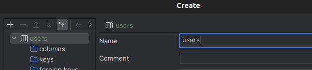

Afegim el camp de id, el qual estarà com a clau primaria

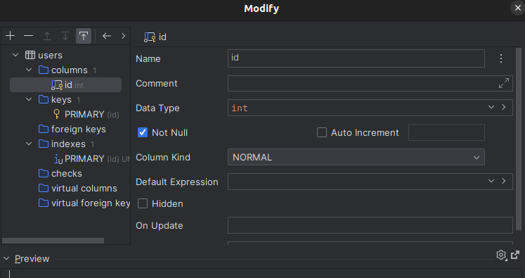

Afegirem també la columna de nom, que serà de tipus **text**

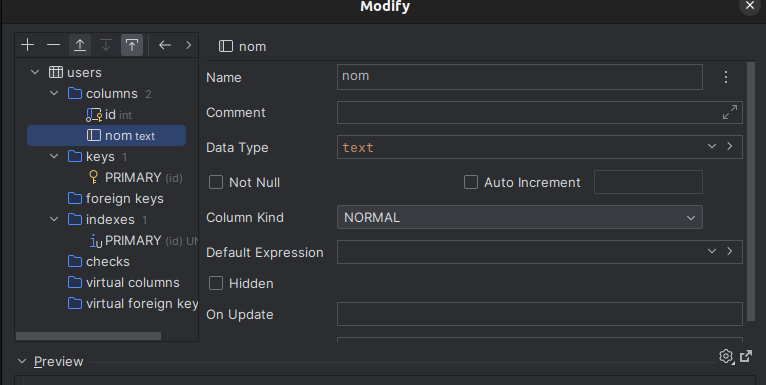

La columna de cognom de tipus **text**

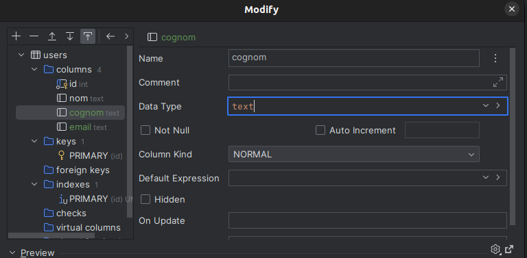

I per ultim afegirem el camp de email

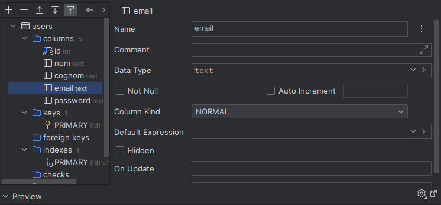

I el de password

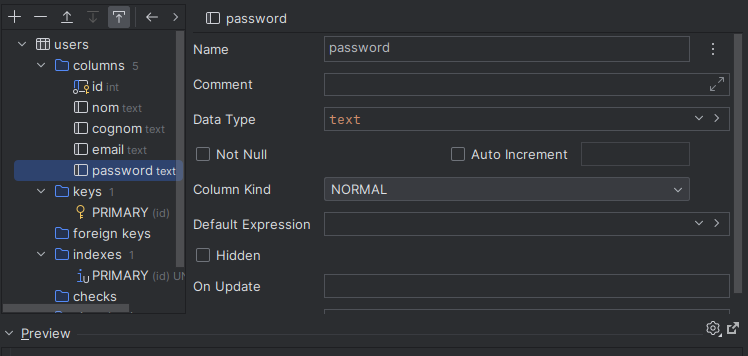

## Crear inserts a la taula users

El que anem a fer ara serà crear inserts dins de la taula 'users'

Anirem a la taula user i farem clic dret per a afegir una row

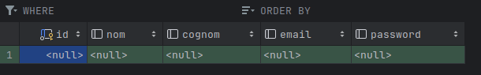

I omplirem els parametres de les taules

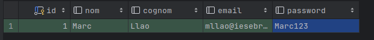

## Crear controlador de users a app

Anirem a la carpeta de app i crearem users.php 

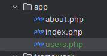

Aquest serà el contingut del fitxer users.php

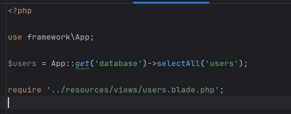

I dins de resources/views/layout tenim que tindre configurat el fitxer users.blade.php

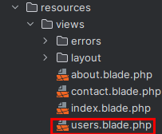
## Crear ruta a routes.php i afegir la nova ruta al navegador

Canviarem el fitxer routes.php afegint la ruta d'users

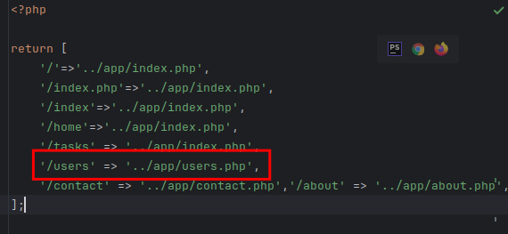

Una vegada afegit anirem al fitxer de nav.blade.php situat a resources/views/layout

I l'editarem afegint la següent línia per a crear el submenu en el navegador
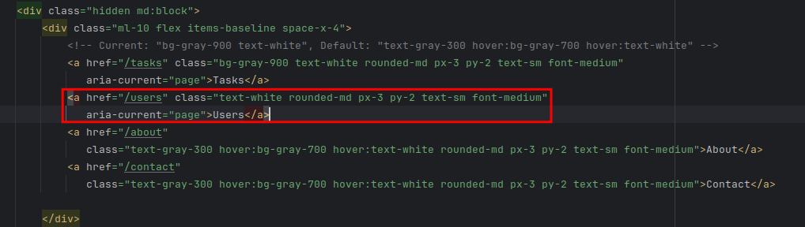

Es veurà de la següent manera
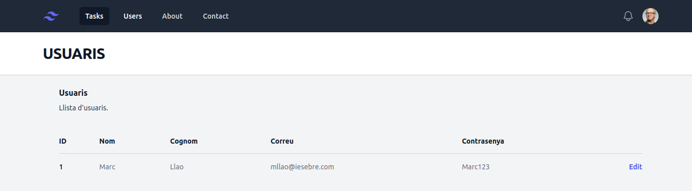

## Crear la vista users.blade.php
Tenim que tindre el fitxer users.blade.php

Així sería com es veu el fitxer users.blade.php
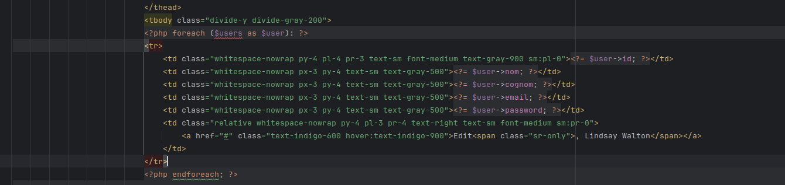